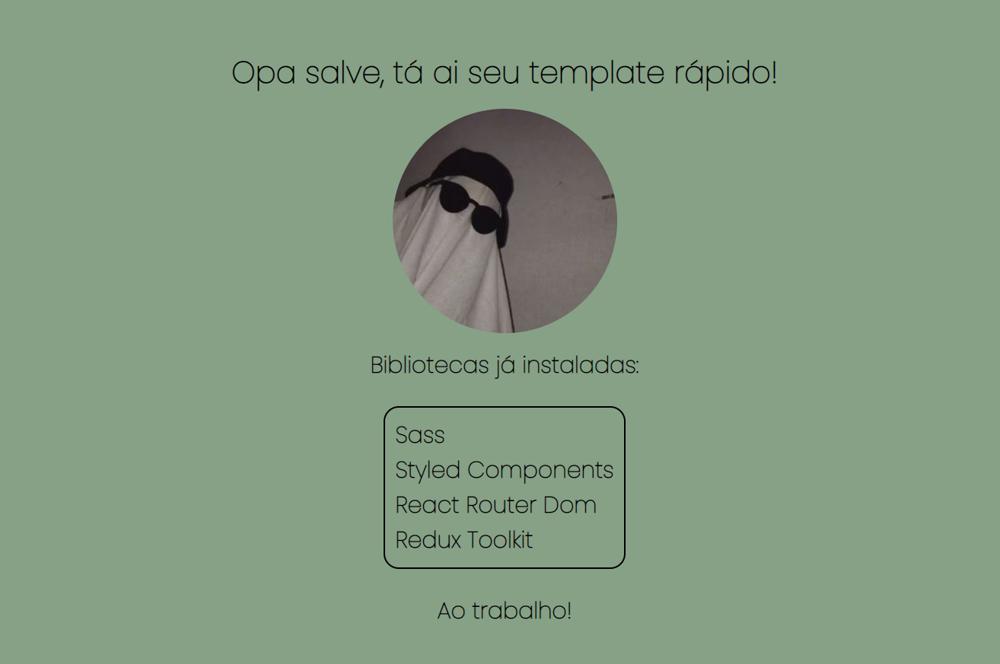

<h2>Olá, esse é meu template pessoal para criar projetos rápidamente!</h2>

<h2>Aqui estão alguns códigos pra instalar outras bibliotecas interessantes</h2>
  <code>yarn add axios</code>
   
  <code>yarn add eslint</code>
   
  <code>yarn add react-icons --save</code>
  <a href="https://react-icons.github.io/react-icons/">Site do React Icons</a>
   
  
<h2>Oque já vem instalado nesse template?</h2>
  <code>yarn add sass</code>
   
  <code>yarn add styled-components</code>
   
  <code>yarn add react-router-dom</code>
   
  <code>yarn add react-redux</code>
   
  <code>yarn add @reduxjs/toolkit</code>
   
  
  

